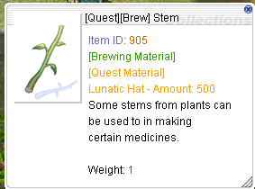
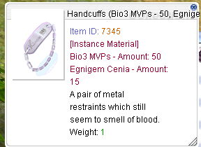
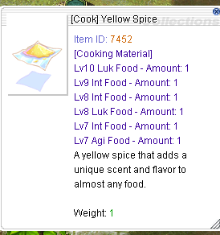
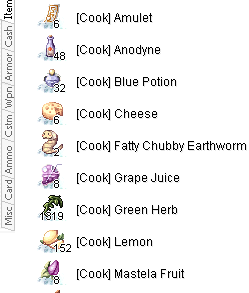

# ItemDescTableModder

A simple tool for customizing item descriptions in `itemInfo_EN.lua` for **Ragnarok Online**.

This lets you add helpful tags and details to item names and descriptions to make crafting, questing, and instance runs more convenient.

---

## 📦 How to Use

1. **Make a backup of your current `itemInfo_EN.lua` file**, just in case you want to restore it later.  
   _(Usually found in `RagnarokFolder/System`.)_
2. Drag and drop the original `itemInfo_EN.lua` file onto the `ItemDescTableModder` program.  
   _(Simply drag the file onto the tool’s icon.)_
3. The tool will generate a new **System** folder containing the updated `itemInfo_EN.lua`.
4. Copy the new **System** folder into your **Ragnarok Online** game directory.
5. If you're asked to overwrite files, click **Yes**.

✅ That’s it! Launch the game and enjoy the updated item descriptions.

---

## 🧰 Requirements

Before you start, make sure you have:

- ✅ A stable **internet connection**  
  _(Needed to fetch data that the tool will use)_

- ✅ **.NET 8 Runtime** installed  
  [Download it here](https://dotnet.microsoft.com/en-us/download/dotnet/8.0)  
  _(Choose the “Run apps” version for your system — Windows x64 in most cases)_

> 💡 _Not sure if you already have .NET 8?_  
> Just run the tool — if it doesn't launch, install the runtime above and try again!

## ✨ Features

### 🏷️ Item Name Modifications

- `[Brew]` — for materials used in Potion/Poison creation (based on RMS Creation DB)
- `[Cook]` — for Lv7–10 stat food ingredients
- `[Quest]` — for server-exclusive quest item crafting materials
- `({MVP Name} - {Qty})` — instance-related items now include the MVP name and quantity  
  _Example: `Steel (Vesper - 5)`_

### 📝 Description Additions

- **Item ID** — now displayed for easy reference
- `[Brewing Material]` — for crafting ingredients
- `[Cooking Material]` — with a list of related stat foods
- `[Quest Material]` — with the names of related server-exclusive quest items
- `[Instance Material]` — listing relevant MVP instances where it’s needed

### 🖼️ Samples

_(Sample images shown may become **outdated** as new features are added)_

  
  
  
  
  
  

---

## ⚙️ Configuration

Want to customize which tags show up or change text colors?

You can tweak the behavior of the tool using the included `ItemDescTableModder.conf` file.

✅ **Enable or disable tags**

🎨 **Set your own hex-based colors**

✏️ **Edit tag labels (e.g., "Brew", "Quest")**

📦 **All from one easy-to-edit file!**

👉 **See the full config guide here:**
[`README_Config.md`](./README_Config.md)  
_(or open `ItemDescTableModder.conf` directly in your editor to start customizing)_

---

## 🛡️ Tips & Reminders

- **Always back up** your original `itemInfo_EN.lua` before making any changes.
- If something breaks or looks wrong in-game, try restoring the backup or **re-downloading patches** using your game patcher to fix it.
- **Note:** Future game patches may **automatically overwrite** your modified `itemInfo_EN.lua`. If that happens, just run this tool again to reapply the changes.

---

Feel free to contribute or suggest improvements.
