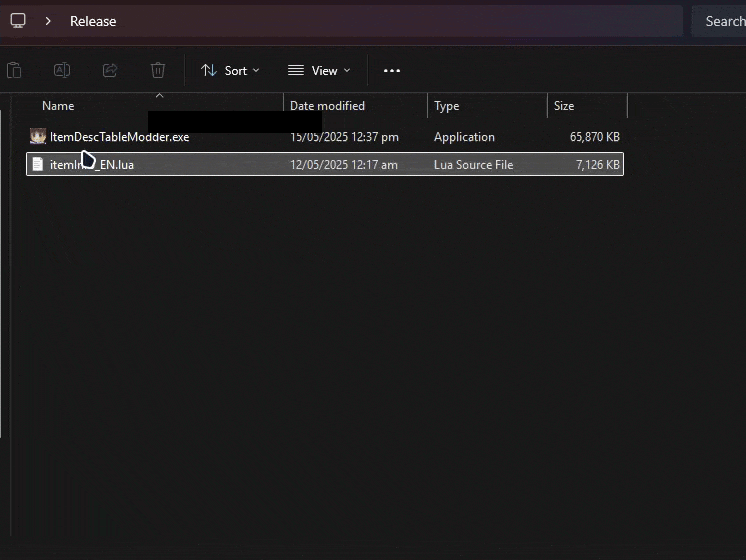

# ItemDescTableModder

Simple tool to modify the client-side item description table `itemInfo_EN.lua` for Ragnarok Online.

## Usage

Click and drag existing `itemInfo_EN.lua` onto the executable.
This will create a `System` folder containg a new `itemInfo_EN.lua` with the modified descriptions.

## Features
### Display Name:
- All Potion Making & Poison Bottle Mats (based from RMS Creation DB) - Prefixed with `[Brew]`
- Lv7~10 Stat Foods Materials - Prefixed with `[Cook]`
- Quest Hats from Crafter NPC - Prexed with `[Quest]`
- All Instance MVPs from wiki - Suffixed with `({mvpname} - {required quantity})` *example: `Steel (Vesper - 5)`*

### Description:
- Item ID - Displays Item Ids
- Brewing Materials `[Brewing Material]`
- Cooking Materials `[Cooking Material]` listing down related foods
- Quest Materials `[Quest Material]` listing down related quest hats
- Instance Materials `[Instance Material]` listing down related Mvp Instances
