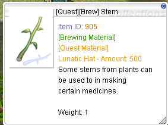
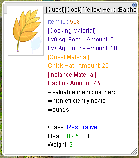
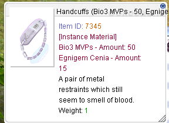
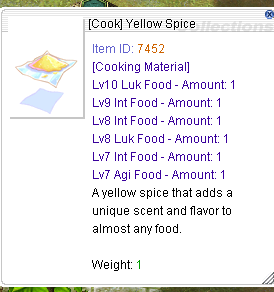
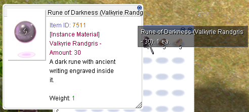
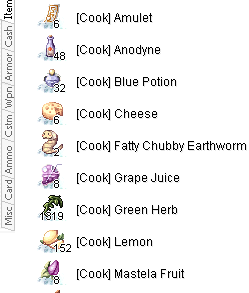

# ItemDescTableModder

A simple tool for customizing item descriptions in `itemInfo_EN.lua` for **Ragnarok Online**.

This lets you add helpful tags and details to item names and descriptions to make crafting, questing, and instance runs more convenient.

---

## 📦 How to Use

  

1. **Make a backup of your current `itemInfo_EN.lua` file**, just in case you want to restore it later.  
   _(Usually found in `RagnarokFolder/System`.)_
2. Drag and drop the original `itemInfo_EN.lua` file onto the `ItemDescTableModder` program.  
   _(Simply drag the file onto the tool’s icon.)_
3. The tool will generate a new **System** folder containing the updated `itemInfo_EN.lua`.
4. Copy the new **System** folder into your **Ragnarok Online** game directory.
5. If you're asked to overwrite files, click **Yes**.

✅ That’s it! Launch the game and enjoy the updated item descriptions.

---

## ✨ Features

### 🏷️ Item Name Modifications
- `[Brew]` — for materials used in Potion/Poison creation (based on RMS Creation DB)
- `[Cook]` — for Lv7–10 stat food ingredients
- `[Quest]` — for server-exclusive quest item crafting materials
- `({MVP Name} - {Qty})` — instance-related items now include the MVP name and quantity  
  _Example: `Steel (Vesper - 5)`_

### 📝 Description Additions
- **Item ID** — now displayed for easy reference
- `[Brewing Material]` — for crafting ingredients
- `[Cooking Material]` — with a list of related stat foods
- `[Quest Material]` — with the names of related server-exclusive quest items
- `[Instance Material]` — listing relevant MVP instances where it’s needed

### 🖼️ Samples

  
  
  
  
  
  

---

🛡️ **Tip:** Always keep a copy of the original file before replacing it — in case anything goes wrong or you want to switch back.

Enjoy a more organized and informative Ragnarok item database!  
Feel free to contribute or suggest improvements.
